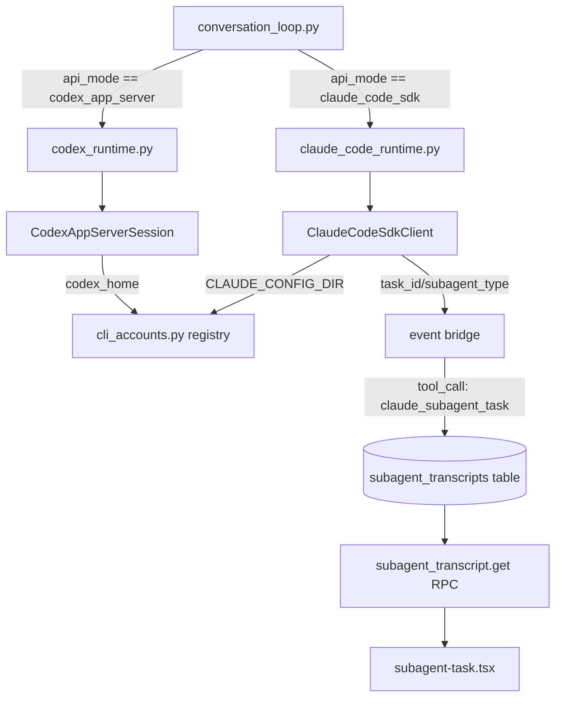

# Claude Code CLI Integration — Transport, Sub-Agent Visibility, Multi-Account

Status: design proposal (not yet implemented)
Supersedes: nothing (net-new capability alongside the existing Codex app-server transport)

## Why this

Three related gaps, one feature:

1. Hermes wraps Codex via a first-class transport
   (`agent/transports/codex_app_server.py`) using subscription/OAuth auth
   instead of a raw API key. Claude Code has no equivalent — the only existing
   Claude path is `anthropic_messages` fed by an OAuth-derived bearer token
   (see the naming-collision note below), not the `claude` CLI's own agent
   loop, tools, or Task sub-agents.
2. When Claude Code's own Task tool spawns a sub-agent, Hermes has nowhere to
   show that in Desktop's conversation view — today it would either be
   dropped or, worse, misrouted into the unrelated `delegate_task`/kanban
   sub-agent panel (see Deliberate deviations).
3. Both Codex and Claude Code today use whichever single host-level
   `~/.codex` / `~/.claude` the CLI already happens to be logged into. There's
   no way to register several named accounts (work / personal / client) and
   pick one per conversation, let alone switch mid-conversation.

## Architecture in prose

Three capabilities, one shared substrate:

- **Transport** (`agent/transports/claude_code_sdk.py` +
  `agent/claude_code_runtime.py`) — a new `api_mode = "claude_code_sdk"`,
  wired the same way `codex_app_server` is wired: an early-return dispatch in
  `agent/conversation_loop.py`, not the transport registry. It drives the
  `claude` CLI via `claude-agent-sdk-python`'s `ClaudeSDKClient`, isolated
  into its own subprocess/config dir per account.
- **Sub-agent visibility** rides on top of the transport: `task_id` /
  `subagent_type` on SDK messages becomes a `tool_call` entry
  (`claude_subagent_task`) in the normal event stream, persisted like any
  other tool call, with the full nested transcript in a new sidecar table
  fetched on demand.
- **Multi-account** (`agent/cli_accounts.py`) is a registry both the Codex and
  Claude Code sessions read `config_dir` from at session-construction time.
  `AIAgent.switch_cli_account()` tears down and respawns the live session on
  demand — safe because both transports pass Hermes's full conversation
  history per turn rather than owning a persistent server-side thread.



## 1. `agent/transports/claude_code_sdk.py` (new)

Wraps `claude-agent-sdk-python`'s `ClaudeSDKClient` (a real asyncio-native
PyPI package: `async def query()`, `async for message in
client.receive_messages()`) inside a dedicated background thread running its
own asyncio event loop, exposing a **synchronous, blocking-queue** facade.

This is a different shape than its sibling `codex_app_server.py`, which
hand-rolls a JSON-RPC-over-stdio wire client with zero package dependency.
That module's own comment explains Hermes deliberately avoids asyncio in the
main call path because `AIAgent.run_conversation()` is synchronous. This
module resolves the same tension by isolating all asyncio usage inside its
own thread — it never leaks upward.

**New dependency.** `pyproject.toml`'s `[project.optional-dependencies]`
(alongside `anthropic = ["anthropic==0.87.0"]`) gets a new pinned extra:

```toml
claude-code = ["claude-agent-sdk==0.2.126"]
```

Import it lazily inside the module, not at top level, so users who never
enable this runtime don't need it installed.

**Binary check.** Needs its own `check_claude_binary()`, mirroring
`check_codex_binary()` / `MIN_CODEX_VERSION` / `parse_codex_version` in
`codex_app_server.py` — the SDK's own version pin doesn't guarantee the
`claude` CLI binary itself is present or compatible.

**Env isolation** mirrors the confirmed Codex pattern exactly:

```python
spawn_env = hermes_subprocess_env(inherit_credentials=True)
if env:
    spawn_env.update(env)
if claude_config_dir:
    spawn_env["CLAUDE_CONFIG_DIR"] = claude_config_dir
```

No changes needed to the shared `hermes_subprocess_env` helper
(`tools/environments/local.py`) itself.

**Class shape** (mirrors `CodexAppServerClient`'s public surface so the
runtime layer is structurally parallel):

```python
class ClaudeCodeSdkError(RuntimeError): ...

class ClaudeCodeSdkClient:
    def __init__(self, claude_config_dir: Optional[str] = None, extra_env: Optional[dict] = None): ...
    def start(self) -> None: ...
    def send_turn(self, user_input: str, *, session_id: Optional[str] = None) -> None: ...
    def take_event(self, timeout: float = 0.0) -> Optional[dict]: ...
    def interrupt(self) -> None: ...
    def is_alive(self) -> bool: ...
    def close(self, timeout: float = 3.0) -> None: ...
```

`take_event`'s dict payload carries whatever the SDK's `SDKMessage` subtypes
expose (assistant text deltas, `tool_use`/`tool_result` blocks) and,
critically, `task_id`/`subagent_type` when the message originates from a
Task-tool sub-agent — so the runtime-layer projector needs no SDK-object
knowledge.

**Approval bridging (decision: bridge through Hermes's existing flow).** The
SDK exposes a `can_use_tool` permission-callback hook. Wire it to a new
`_claude_code_approval_callback` in `claude_code_runtime.py`, mirroring how
Codex's session takes an `approval_callback` resolved via
`tools.terminal_tool._get_approval_callback()`. Reuse
`tools.approval.is_approval_bypass_active()` gating exactly like Codex, and
route interactive prompts through the same `prompt_dangerous_approval()` flow
Codex already uses — approval UX stays consistent regardless of which CLI
transport is active, rather than letting Claude's CLI use its own
independent permission mode.

## 2. `agent/claude_code_runtime.py` (new) — mirrors `agent/codex_runtime.py`

**Wiring point** (confirmed exact from source): `codex_app_server` is
dispatched via a hard-coded early return in `agent/conversation_loop.py`
(line 813: `if agent.api_mode == "codex_app_server": return
agent._run_codex_app_server_turn(...)`), **not** through the transport
registry in `agent/transports/__init__.py` (`get_transport()` /
`register_transport()` only has `anthropic`, `codex` Responses,
`chat_completions`, `bedrock` — `codex_app_server` is intentionally absent
from that registry, since the early return means it's never reached).

`claude_code_sdk` follows the identical pattern:

- a new `if agent.api_mode == "claude_code_sdk": return
  agent._run_claude_code_sdk_turn(...)` branch in `conversation_loop.py`
- a matching thin forwarder method on `AIAgent` (mirrors
  `agent._run_codex_app_server_turn` in `run_agent.py:6678`)
- a sibling `agent.claude_code_runtime` module, explicitly **not** registered
  in the transports registry

**Event bridge.** `make_claude_code_sdk_event_bridge(agent)` mirrors
`make_codex_app_server_event_bridge` (`agent/codex_runtime.py:428`) exactly:
closures over `agent`, dispatches to `agent.tool_progress_callback`,
`agent.tool_start_callback` / `tool_complete_callback`,
`agent._fire_stream_delta`, `agent._fire_reasoning_delta`,
`agent._emit_interim_assistant_message`, all wrapped in try/except +
`logger.debug`, never allowed to kill the turn loop.

New branch not present in the Codex version: when a message carries
`task_id`/`subagent_type`, emit a tool_call entry named
`claude_subagent_task` (chosen to avoid the naming collision explained in
component 4 — this exact string is used consistently for the tool_call name
everywhere in this doc) instead of, or alongside, the normal tool
started/completed callbacks. See component 4 for what goes in that entry's
persisted payload.

**Usage recording.** New `_record_claude_code_sdk_usage`, mirroring
`_record_codex_app_server_usage` (`agent/codex_runtime.py:46`) field-for-field,
but sourcing token counts from Claude's usage block (`input_tokens`,
`output_tokens`, `cache_creation_input_tokens`, `cache_read_input_tokens`) —
note Claude **does** expose cache-write tokens, unlike Codex app-server,
which the existing code notes explicitly does not; don't zero out
`cache_write_tokens` the way the Codex version has to. Same
`agent.session_api_calls += 1` even-on-empty-usage counting, same
`_session_db.update_token_counts(...)` persistence, same
`CanonicalUsage` / `estimate_usage_cost` reuse.

**Session lifetime.** One client per `AIAgent` instance, lazily spawned on
first use — mirror the `if not hasattr(agent, "_codex_session")` lazy-init
block in `run_codex_app_server_turn` (`codex_runtime.py:639`), verbatim, for
`agent._claude_code_session`. Reused across turns. Mirror the existing
`should_retire` signal → session `.close()` + clear the cached attribute, so
a wedged background thread/event loop gets torn down and respawned next turn
rather than ridden forever.

**Live account hot-swap (decision: mid-conversation switching required, not
next-session-only).** New method `AIAgent.switch_cli_account(provider: str,
account_name: str) -> None`:

1. Resolve the named account via `cli_accounts.py`.
2. If a live session exists for that provider (`agent._codex_session` or
   `agent._claude_code_session`), interrupt any in-flight turn and close the
   session, then clear the cached session attribute.
3. Record the newly active account (`agent._active_cli_accounts[provider] =
   resolved_account`).

The next turn's lazy-init block picks up the new account's `config_dir` when
constructing a fresh session.

Conversation continuity is preserved across the swap because both Codex
app-server and the Claude Agent SDK take Hermes's own full
conversation-so-far as per-turn context — not a persistent server-side
thread tied to one process. Tearing down and respawning the subprocess on an
account switch does not lose conversation history.

Trigger points: a new slash command (`/cli-account claude_code work`) and a
Desktop UI account-picker action, both calling `switch_cli_account()`.

**In-scope, non-free work on the Codex side.** Making Codex's side of
multi-account real requires changing `codex_runtime.py`'s existing
session-construction call site (`agent._codex_session =
CodexAppServerSession(cwd=..., approval_callback=..., ...)` around line 680)
to thread through `codex_home=resolved_account.config_dir`.
`CodexAppServerClient` already accepts and honors a `codex_home` param, but
`codex_runtime.py` currently never passes one — today Codex always uses
whichever `~/.codex` the CLI is already logged into on the host. This is a
real change to an existing file, not new-file-only work.

## 3. `api_mode` plumbing — two separate gates, both need updating

`agent/agent_init.py` (line ~581) has an existing set:

```python
{"chat_completions", "codex_responses", "anthropic_messages", "bedrock_converse", "codex_app_server"}
```

Add `"claude_code_sdk"`.

Separately, `hermes_cli/runtime_provider.py` has its **own**
`_VALID_API_MODES` set (line ~349) and `_parse_api_mode()` gate, validating
`model.api_mode` from `config.yaml` before an `AIAgent` is even constructed.
`codex_app_server` reaches this only via a dedicated rewrite function
`_maybe_apply_codex_app_server_runtime()`, gated on `provider in {"openai",
"openai-codex"}` AND `model.openai_runtime == "codex_app_server"`, called
from `_resolve_runtime_from_pool_entry`'s Anthropic-adjacent branch (~line
446).

`claude_code_sdk` needs the identical second gate:

- add `"claude_code_sdk"` to `_VALID_API_MODES`
- add `_maybe_apply_claude_code_sdk_runtime()`, gated on `provider ==
  "anthropic"` AND a new `model.anthropic_runtime == "claude_code_sdk"` config
  key — the direct sibling of `model.openai_runtime == "codex_app_server"`,
  same location in `config.yaml`, same on/off semantics

## 4. `agent/cli_accounts.py` (new, shared across both providers) + transcript persistence

Confirmed genuinely new, **not** overlapping with the existing
`agent/credential_pool.py` (2700-line multi-credential system:
`PooledCredential`, `CredentialPool`, rotation strategies, `hermes auth
add/list/remove --label`). That system manages API credentials Hermes itself
holds and rotates automatically for failover. `cli_accounts.py` manages
isolated home directories for external CLI subprocesses (`codex`, `claude`)
that own their auth files independently. Different trust/data model,
correctly kept separate.

**Naming-collision warning (document prominently).**
`agent/credential_sources.py` (lines ~399-403) already has a literal source
string `"claude_code"` meaning "OAuth credentials read from
`~/.claude/.credentials.json` and fed as a bearer token into the existing
`anthropic_messages` transport for direct `api.anthropic.com` calls" — a
completely different, already-shipped feature from the new `claude_code_sdk`
transport (which drives the actual `claude` CLI's own full agent loop, tools,
and Task sub-agents). New account-registry entries and the new tool_call
name (component 2) must **not** reuse the bare string `"claude_code"`, to
avoid `hermes auth list` output becoming ambiguous between the two unrelated
features.

**Config schema slot.** `hermes_cli/config.py` has a schema-validation layer
(`DEFAULT_CONFIG`, `_OPEN_DICT_TOP_LEVEL_KEYS`, `_DYNAMIC_TOP_LEVEL_KEYS`,
`_validate_config_key`) used by `hermes config set` / `hermes doctor` to
reject unknown top-level keys. Register a new `cli_accounts:` key,
dict-shaped and keyed by account name
(`cli_accounts: {<name>: {provider, config_dir}}`) for `hermes config set
cli_accounts.<name>.provider`-style ergonomics — add it to
`_OPEN_DICT_TOP_LEVEL_KEYS` (same bucket as `providers`, `mcp_servers`),
**not** the list-shaped `_DYNAMIC_TOP_LEVEL_KEYS` bucket.

**Class shape:**

```python
@dataclass
class CliAccount:
    name: str
    provider: Literal["codex", "claude_code"]
    config_dir: str  # resolves to CODEX_HOME or CLAUDE_CONFIG_DIR at spawn time

def load_cli_accounts() -> list[CliAccount]: ...
def resolve_cli_account(name: str, provider: str) -> Optional[CliAccount]: ...
def probe_cli_account(account: CliAccount) -> tuple[bool, str]:
    ...  # codex: check_codex_binary() + lightweight login-status probe against config_dir
    ...  # claude_code: check_claude_binary() + verify CLAUDE_CONFIG_DIR/.credentials.json readable/valid
```

**Sub-agent transcript persistence (decision: persist full nested
transcripts, not live-only).** New sidecar storage: a `subagent_transcripts`
table in the existing per-session sqlite db (the same DB
`_session_db.update_token_counts(...)` already writes into), keyed by
`(session_id, task_id)`, storing the full ordered list of the sub-agent's own
projected events (assistant text, tool calls/results) as JSON.

The main conversation's persisted tool_call `result` field stores **only** a
compact summary plus the `task_id` (same truncation convention Codex already
uses for its own tool results —
`_codex_item_completion_payload`'s `[:4000]`-char convention) — never the
full nested payload inline.

Desktop's component fetches full detail on expand via a new gateway RPC
(`subagent_transcript.get {session_id, task_id}`), which works identically
whether the session is still live or was reloaded from history, since it's
always sourced from the persisted table.

## 5. `hermes_cli/subcommands/accounts.py` + handler module

Two pieces, following the codebase's existing parser/handler split (confirmed
via `hermes_cli/subcommands/model.py`, which is parser-only — the actual
handler logic for `model.py`'s parser lives in `hermes_cli/main.py`, itself
mid-refactor out of a "god file", so `main.py` is **not** the mirror target
for new handler code):

1. `hermes_cli/subcommands/accounts.py` — thin, `build_accounts_parser(
   subparsers, *, cmd_accounts_add, cmd_accounts_list, cmd_accounts_remove)`.
2. `hermes_cli/account_commands.py` (new) — mirror
   `hermes_cli/auth_commands.py` directly, which already has the exact
   needed shape: `auth_add_command` / `auth_list_command` /
   `auth_remove_command` / `_pick_provider`, and already demonstrates
   "probe/validate before persisting" (its Anthropic branch calls
   `anthropic_adapter.run_hermes_oauth_login_pure()` synchronously, raising
   `SystemExit` on failure before anything is saved). Model
   `accounts_add_command` on this exact pattern: call
   `cli_accounts.probe_cli_account(...)` before persisting, exactly like
   `auth_add_command` validates OAuth before `pool.add_entry(...)`.

**Wiring.** Register in `hermes_cli/main.py` alongside the existing
`build_model_parser` import/call (~line 426 / ~14389).

## 6. Desktop: sub-agent visibility

**Dispatch mechanism** (confirmed, corrected from an earlier draft that
assumed a generic item-type registry — there isn't one):
`apps/desktop/src/components/assistant-ui/thread/message-parts.tsx` has a
`ChainToolFallback` component that does a plain string-equality branch on
`props.toolName`:

```tsx
const ChainToolFallback: FC<ToolCallMessagePartProps> = props => {
  if (props.toolName === 'todo') return null
  if (props.toolName === 'image_generate') return <ImageGenerateTool {...props} />
  if (props.toolName === 'clarify') return <ClarifyTool {...props} />
  return <ToolFallback {...props} />
}
```

passed to assistant-ui as `tools: { Fallback: ChainToolFallback }`.
`toolName` is the same `name` field the Python event bridge synthesizes for
every tool call (e.g. `_codex_item_to_tool_name()`'s `"exec_command"`,
`"apply_patch"`). Add one more branch:

```tsx
if (props.toolName === 'claude_subagent_task') return <SubagentTask {...props} />
```

**File placement.** `apps/desktop/src/components/assistant-ui/tool/subagent-task.tsx`,
co-located with its test — matching where `approval.tsx` / `approval.test.tsx`
actually live — **not** next to `clarify-tool.tsx`, which lives one directory
above `tool/`, at `assistant-ui/clarify-tool.tsx` directly.

**Data fetching.** Since transcripts are persisted (component 4),
`subagent-task.tsx` calls the new `subagent_transcript.get` gateway RPC on
expand, rather than expecting the full transcript embedded inline in the
tool_call payload.

## Deliberate deviations from existing patterns

**Inline-collapsed vs the existing sub-agent panel.** Hermes already has a
full, separate sub-agent-visibility subsystem for its own
`delegate_task`/kanban-worker mechanism —
`apps/desktop/src/store/subagents.ts` (`SubagentProgress` / `SubagentNode`
with `id` / `parentId` / `goal` / `status` / `stream`, token/cost tracking),
rendered in a separate `apps/desktop/src/app/agents/index.tsx` panel, fed by
dedicated WebSocket gateway events (`subagent.spawn_requested`,
`subagent.start`, etc.) entirely separate from the chat-message stream.

This feature deliberately does **not** reuse that mechanism, because it needs
to persist inline with and reload from the durable message history the same
way every other tool call does — `subagentsBySession` is
ephemeral/session-scoped and panel-only, which is architecturally the
opposite of what inline-collapsed-in-conversation-history requires. This is a
deliberate choice, not an oversight.

**Hot-swap over next-session-only switching.** Account switching could have
been scoped to "pick an account when starting a new conversation" (no new
runtime behavior, no session teardown mid-flight). The decision here is
**live mid-conversation switching**: `switch_cli_account()` interrupts and
respawns the live session, keeping conversation history intact, because both
transports pass full conversation-so-far context per turn rather than owning
a persistent server-side thread. This has no existing precedent in the
codebase to copy — it's new behavior, and is called out explicitly in the
testing plan below.

## Testing plan

Mirror the actual existing Codex test layout (corrected from an earlier draft
that pointed at `tests/providers/`, which is unrelated — it tests the
provider-profile plugin system, not Codex fixtures):

- `tests/agent/transports/test_codex_app_server_runtime.py`
- `tests/agent/transports/test_codex_app_server_session.py`
- `tests/agent/transports/test_codex_event_projector.py`
- `tests/agent/test_codex_app_server_event_bridge.py`
- `tests/agent/test_codex_app_server_persist.py`
- `tests/run_agent/test_codex_app_server_integration.py`
- `tests/run_agent/test_codex_app_server_compaction.py`

Add Claude-side siblings across these same three directories
(`tests/agent/transports/`, `tests/agent/`, `tests/run_agent/`):

- Fake-SDK-client unit tests for `claude_code_sdk.py` (queue semantics,
  `CLAUDE_CONFIG_DIR` plumbing).
- Event-bridge projection tests for `claude_code_runtime.py`, especially
  `task_id`/`subagent_type` → tool_call-name mapping and the
  transcript-persistence sidecar write.
- An integration test asserting a Task-tool call produces a persisted
  `subagent_transcripts` row plus the correctly-shaped tool_call entry.
- Desktop: a component test for `subagent-task.tsx` alongside
  `approval.test.tsx`'s existing pattern.
- A mid-conversation `switch_cli_account()` test (session torn down and
  respawned, conversation history intact) — new behavior with no existing
  precedent to copy.
